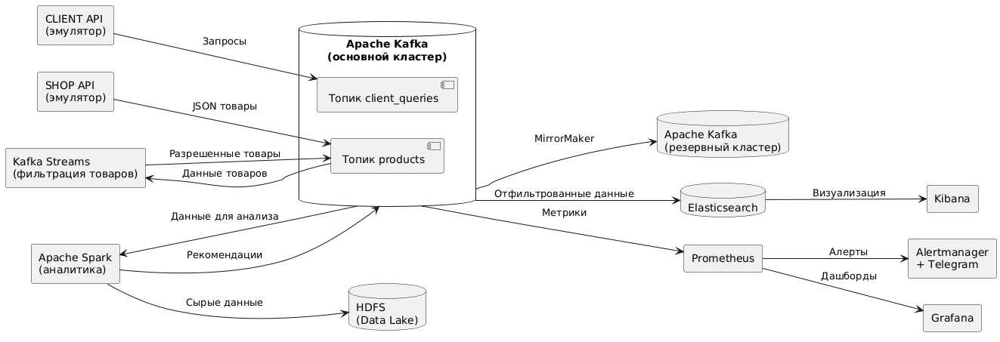

# Аналитическая платформа для маркетплейса "Покупай выгодно"

## Описание проекта

Проект представляет собой аналитическую платформу для маркетплейса, которая:
1. Собирает данные о товарах и клиентских запросах
2. Обрабатывает данные в реальном времени
3. Фильтрует запрещенные товары
4. Анализирует поведение клиентов
5. Формирует рекомендации
6. Обеспечивает мониторинг работы системы

## Использованные технологии

- **Apache Kafka** (с TLS и ACL) - потоковая передача данных
- **Kafka Streams** - фильтрация запрещенных товаров
- **Apache Spark** - аналитическая обработка
- **HDFS** - хранение сырых данных
- **Elasticsearch** - поиск и индексация
- **Prometheus** + **Grafana** - мониторинг
- **Alertmanager** - алертинг (с интеграцией Telegram)
- **Docker** - контейнеризация сервисов

## Архитектура системы



## Инструкция по запуску

### 1. Предварительные требования

- Docker и Docker Compose
- 8+ GB оперативной памяти
- 4+ CPU ядер

### 2. Клонирование репозитория

```bash
git clone https://github.com/your-repo/marketplace-analytics.git
cd marketplace-analytics
```

### 3. Генерация SSL сертификатов

```bash
./generate_ssl.sh
```

### 4. Запуск системы

```bash
docker-compose up -d
```

### 5. Инициализация сервисов

```bash
# Настройка Kafka
./scripts/setup_kafka.sh

# Настройка Elasticsearch коннекторов
./scripts/setup_elasticsearch_connector.sh

# Запуск Spark обработки
./scripts/run_analytics.sh
```

### 6. Доступ к сервисам

| Сервис | URL | Учетные данные |
|--------|-----|----------------|
| Grafana | http://localhost:3000 | admin/admin |
| Prometheus | http://localhost:9090 | - |
| Alertmanager | http://localhost:9093 | - |
| Kibana | http://localhost:5601 | - |
| Kafka UI | http://localhost:8080 | - |

## Реализация компонентов

### 1. Источники данных

- **SHOP API эмулятор** (`shop_api_emulator.py`):
  - Чтение товаров из JSON файла
  - Отправка в Kafka топик `products` с TLS аутентификацией

- **CLIENT API эмулятор** (`client_api_emulator.py`):
  - CLI интерфейс для поиска товаров и получения рекомендаций
  - Логирование запросов в Elasticsearch

### 2. Потоковая обработка

- **Фильтр запрещенных товаров** (Kafka Streams):
  - Чтение из топика `products`
  - Фильтрация по списку запрещенных товаров
  - Запись разрешенных товаров в топик `filtered_products`

### 3. Аналитическая система

- **Spark обработчик** (`spark_analytics.py`):
  - Агрегация данных по категориям
  - Расчет средних цен и доступности
  - Запись результатов в HDFS и Kafka

### 4. Хранение данных

- **Elasticsearch**:
  - Индексы `filtered_products` и `client_queries`
  - Полнотекстовый поиск по товарам
  - Аналитика запросов

### 5. Мониторинг

- **Prometheus**:
  - Сбор метрик с Kafka через JMX Exporter
  - Мониторинг доступности брокеров
  - Трекинг ключевых показателей

- **Grafana**:
  - Дашборды для визуализации метрик
  - Отслеживание нагрузки на кластер

- **Alertmanager**:
  - Уведомления в Telegram о проблемах
  - Алёрты для критических событий

## Тестирование системы

1. Отправка тестовых товаров:
```bash
python shop_api_emulator.py
```

2. Эмуляция клиентских запросов:
```bash
python client_api_emulator.py search --name "часы"
python client_api_emulator.py recommend --user-id user123
```

3. Проверка данных в Elasticsearch:
```bash
curl -X GET "http://localhost:9200/filtered_products/_search?q=name:часы"
```

4. Проверка алертов (остановите один из брокеров):
```bash
docker stop kafka1
```

## Лицензия

MIT License